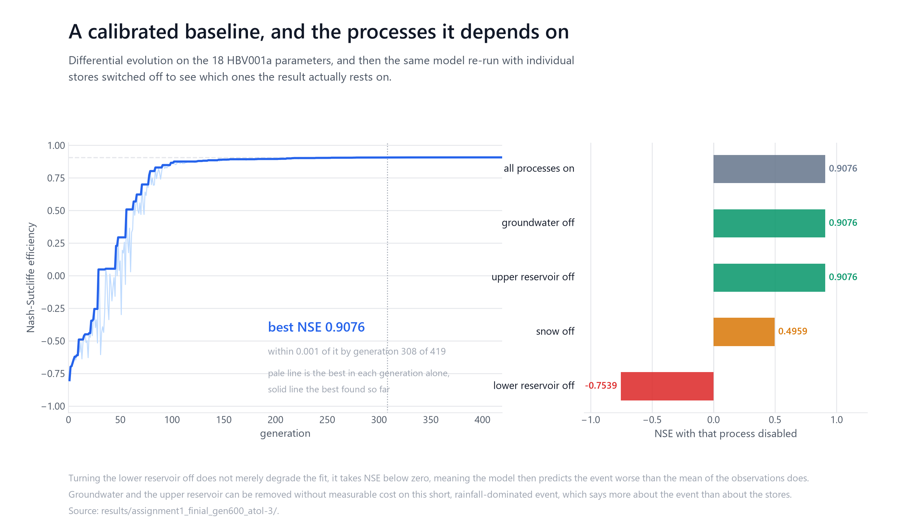
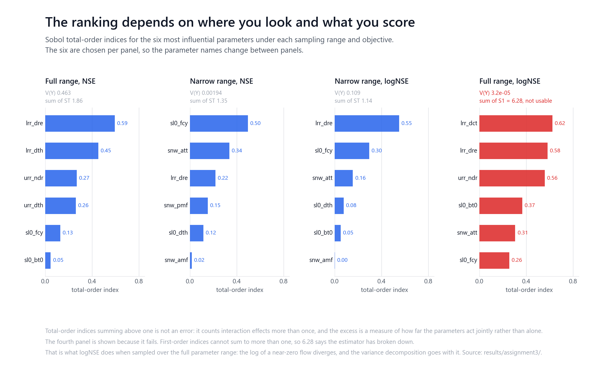
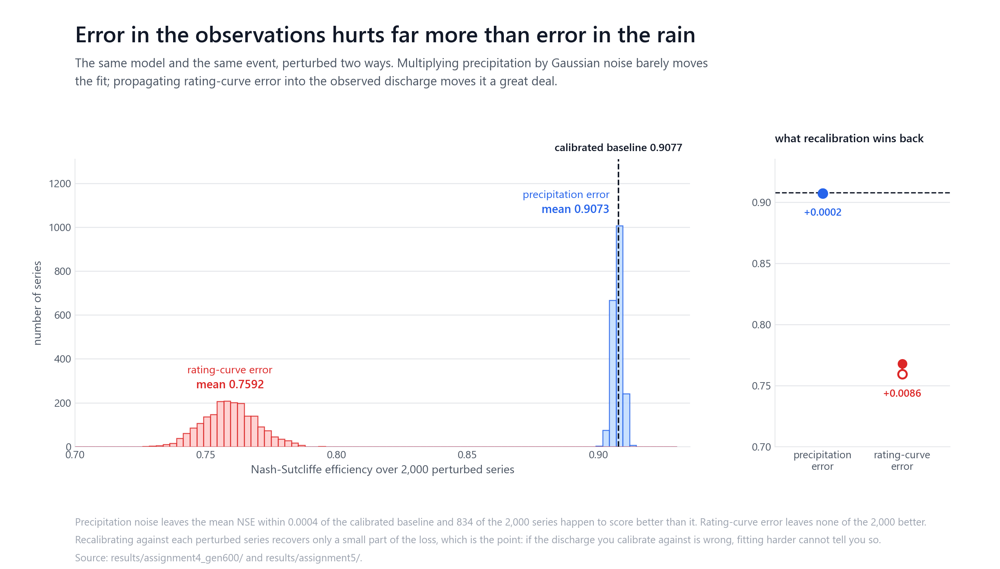
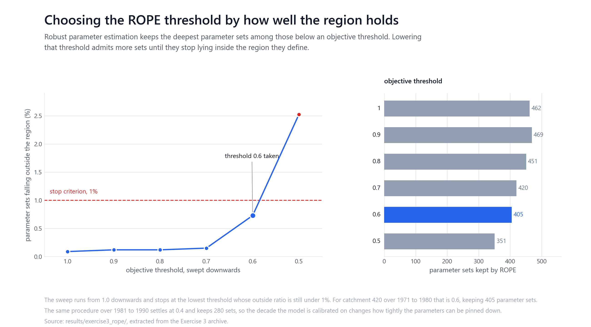

# Uncertainty Quantification in Hydrology

Project seminar, Mathematical Methods for Uncertainty Quantification in Hydrology.
Chair of Hydrology and River Basin Management, Technical University of Munich,
winter semester 2025/26. Group B.

A hydrological model that fits an observed flood event well is not the same thing
as a model you can trust. This repository is the record of a seminar that took one
calibrated rainfall-runoff model and asked, in five steps, how much of its apparent
skill survives contact with the uncertainty around it: in the parameters, in the
rainfall that drives it, and in the discharge it is scored against.

The short answer, and the result the whole sequence builds to, is that the
observations are the weak point. Adding realistic noise to the rainfall leaves the
fit essentially untouched. Propagating realistic rating-curve error into the
observed discharge costs about 0.15 of Nash-Sutcliffe efficiency, and recalibrating
the model against the corrupted record wins back almost none of it.

## Authorship

This is a three-person group submission, and the work is joint. What the git
history records about who committed what:

| Author | Contribution as recorded in the history |
|:--|:--|
| Christine Leers | First working versions of the calibration, local and global sensitivity, and both uncertainty assignment scripts, plus the running task list the group worked from |
| Yihan Shen | Exercise 1 |
| Mohd Zamin Quadri | HBV and Cython integration and data configuration, the production runs behind `results/`, consolidation of the group material into this repository, and report assembly |

Commit counts are a poor measure of who did what here. Most of Christine's commits
add a single file; the consolidation commits move several hundred at once. Neither
number reflects effort. Treat the scientific work as the group's.

## The model and the event

| Property | Value |
|:--|:--|
| Model | HBV001a, a lumped conceptual rainfall-runoff model by Faizan Anwar |
| Parameters | 18, across snow, soil moisture, upper and lower reservoir modules |
| Time step | Hourly |
| Forcing | Temperature, precipitation, potential evapotranspiration |
| Event | A single short, rainfall-dominated high-flow event |
| Objective | 1 minus Nash-Sutcliffe efficiency, minimised |

The event is short and rainfall-dominated, which matters for reading everything
below: it is why the groundwater store turns out to be irrelevant here, and it is
not a general statement about the model.

## Assignment 1: calibration, and what the fit rests on



Differential evolution (`scipy.optimize.differential_evolution`, strategy
`best1bin`, population size 10) over the 18 parameters, run for 419 generations and
75,480 model evaluations. The best objective reached is 0.0924, an NSE of **0.9076**.
The search is within 0.001 of its final value by generation 308.

Individual process stores were then switched off and the model re-run with the
calibrated parameters:

| Configuration | NSE | Reading |
|:--|:--:|:--|
| All processes on | 0.9076 | The calibrated baseline |
| Groundwater off | 0.9076 | No measurable effect on this event |
| Upper reservoir off | 0.9076 | No measurable effect on this event |
| Snow off | 0.4959 | Snowmelt supplies a large part of the volume |
| Lower reservoir off | -0.7539 | The model collapses |

An NSE below zero means the model predicts the event worse than simply using the
mean of the observations would. The lower reservoir is not a refinement here, it is
load-bearing.

## Assignment 2: local sensitivity around the optimum

Each parameter was perturbed one at a time from -30% to +30% in 120 steps, holding
the others at their calibrated values, and scored by the maximum absolute relative
change in the objective. Near the optimum the ranking is led by `sl0_fcy` (field
capacity), followed by `sl0_dth`, `lrr_dre`, the snowmelt factors `snw_pmf` and
`snw_amf`, and `urr_ulc`.

Roughly ten of the eighteen parameters are effectively inactive in this
neighbourhood, for four distinguishable reasons: the perturbation is clamped at a
bound, the process is inactive for this event, the response surface is flat, or the
calibrated value is small enough that a 30% change is negligible. Files recording
which perturbations fell outside the parameter bounds are kept in
`results/assignment2/`, because a parameter that appears insensitive only because
its range was clipped is a different finding from one that is genuinely flat.

## Assignment 3: global sensitivity, and a configuration that fails



Sobol variance decomposition under two sampling ranges crossed with two
objectives. The Saltelli sampling and the index estimator are written out in
`code/Ass_03_Global_SA_Group_B.py` on top of `scipy.stats.qmc`, following Saltelli
et al. (2010), rather than called from a sensitivity-analysis package.

| Configuration | V(Y) | Leading parameter | Sum of ST |
|:--|:--:|:--|:--:|
| Full range, NSE | 0.463 | `lrr_dre` (0.59) | 1.856 |
| Narrow range, NSE | 0.00194 | `sl0_fcy` (0.50) | 1.345 |
| Narrow range, logNSE | 0.109 | `lrr_dre` (0.55) | 1.135 |
| Full range, logNSE | 0.000032 | not usable | 3.072 |

Three things are worth drawing out.

The ranking is not a property of the model alone. Across the full parameter range
the lower-reservoir parameters `lrr_dre` and `lrr_dth` dominate; restricted to a
narrow range around the optimum, `sl0_fcy` leads instead, agreeing with the local
analysis of Assignment 2. Both are correct answers to different questions.

Total-order indices sum well above one, to 1.856 in the full-range NSE case. That is
not an error. Total-order indices count interaction effects once for every parameter
involved, so the excess over one measures how far the parameters act jointly rather
than independently.

The fourth configuration is kept because it fails. First-order indices cannot sum to
more than one, and here they sum to 6.28, which says the estimator has broken down
rather than that the parameters are important. Taking the logarithm of a
near-zero flow diverges, and sampling logNSE over the full range guarantees
near-zero flows. It is reported rather than deleted.

Because the estimator is the group's own rather than a library's, it is worth
having a second symptom that does not depend on reading the same sum. A Sobol
total-order index is bounded below by the first-order index for the same
parameter, whatever the model, so any configuration where that fails has a
broken estimate rather than an interesting one. Across the three configurations
the sections above argue from, it fails for **0 of 17** parameters. In the
discarded one it fails for **9 of 17**, the worst being a first-order index of
1.29 against a total-order index of 0.37. `scripts/check_claims.py` checks all
four. The raw model evaluations behind the indices are not in this repository,
so this is a check on the published indices rather than a recomputation of them.

Narrowing the sampling range shrinks the output variance by a factor of about **238**
under NSE, from 0.463 to 0.00194.

## Assignments 4 and 5: error in the input against error in the output



Both studies generate 2,000 perturbed series, run the model with the Assignment 1
parameters, and then recalibrate against each perturbed series in turn.

**Assignment 4, precipitation.** Each precipitation value is multiplied by an
independent Gaussian factor C drawn from N(1.0, 0.083). The assignment asked for
those multipliers to be clipped to [0.75, 1.25], and the script as submitted
carries that clip commented out, so the run was made without it. The recorded
mean absolute change in precipitation is 6.62%, which is 0.08 standard errors
from what an unclipped N(1.0, 0.083) multiplier gives and 1.9 from the clipped
version, so the numbers agree with the code. About one value in 385 moved by more
than 25%. It changes the mean perturbation in the third decimal place and changes
nothing below, but the run summary records the clipping as applied and it was not.

Mean NSE with the reference parameters is **0.9073**, against a calibrated
baseline of 0.9077: a loss of 0.0004, and 834 of the 2,000 noisy series score
better than the unperturbed record. Recalibration moves the mean by 0.0002, which
`results/assignment4_gen600/uncertainty_analysis_summary.txt` declines to call
compensation: the loss it would be compensating cannot be told from zero, and an
improvement that size is as likely to be the optimiser finding a better optimum,
or fitting the particular noise in each series.

The 834 is the useful number of those three. If roughly 40% of corrupted inputs
produce a better score than the true input, then differences of this size carry no
information about input quality.

**Assignment 5, discharge.** Observed water level is perturbed by an additive
uniform draw on [-25, +25] cm, and the perturbed level is converted back to
discharge through a fitted rating curve: two power laws blended by a sigmoid,
fitting the stage-discharge data with R squared **0.9987** against 0.8831 for a
single global power law. Mean NSE falls to **0.7592**. Not one of the 2,000 series
scores better than the baseline, and recalibration recovers 5.76% of the loss.

The asymmetry is the point of the seminar, and it has to survive the obvious
objection first: the two perturbations are not the same size. The precipitation
series move by 6.62% on average and the reconstructed discharge series by
**15.54%**, so the output was perturbed 2.35 times harder. The loss it produced
is **356** times larger. Dividing each loss by the perturbation that produced it
leaves error in the discharge costing about **152** times as much as error in the
precipitation, and that division assumes the loss grows no faster than linearly
with the perturbation; divide by the square instead, which is the least
favourable reading, and it is still **65**. The conclusion does not rest on the
two perturbations having been the same size.

So the model can absorb noise in what drives it, and it cannot absorb error in
what it is scored against. No amount of refitting will reveal that the target
itself is wrong.

One qualification on what absorbing means here. The precipitation multiplier is
drawn independently for every hour, so the perturbation is uncorrelated in time
and a large part of it cancels when the model integrates rainfall across the
event. Real rainfall error is not like that: gauge undercatch and the gap between
a point measurement and a catchment average persist across a storm. The run
summary makes the same point when it compares this design against Oudin et al.
(2006), who perturbed inputs with bias as well as noise. Assignment 4 shows that
the model absorbs uncorrelated rainfall noise. It does not test a systematic
error, and the result should not be read as though it did.

## Exercises

Three exercises sit alongside the five assignments. They use different models and
tools, and their material is archived rather than laid out in the tree.

**Exercise 1** is a notebook, `code/EX1/EX1_MMUQ_Group_B.ipynb`, committed by Yihan
Shen.

**Exercise 2** is a groundwater problem rather than a rainfall-runoff one: a
MODFLOW-2005 flood and river model driven by SPOTPY's parallel DREAM sampler,
`results/Ex 2 parallel DREAM-20260111.zip`. DREAM is an adaptive Markov chain Monte
Carlo method, so this is the Bayesian counterpart to the point-estimate calibration
of Assignment 1. It was run across four MPI ranks, and the archive holds the setup
(`spot_setup_modflow.py`, `run_dream.py`), the per-rank model directories, and
posterior parameter uncertainty plots for the Alzpitz, B1, B3 and B4 observation
points.

**Exercise 3** applies ROPE, robust parameter estimation by data depth, to daily HBV
runs for catchment 420 over two decades.



ROPE keeps the deepest parameter sets among those scoring below an objective
threshold. Lowering that threshold admits more sets, until the sets it admits stop
lying inside the region they themselves define. Sweeping the threshold down from 1.0
and stopping at the lowest value whose outside ratio is still under 1% selects
**0.6** for 1971 to 1980, keeping **405** parameter sets. The same procedure over 1981
to 1990 settles at **0.4** and keeps **280**. The decade the model is calibrated on
changes how tightly its parameters can be pinned down.

The Exercise 3 archive is 2.1 GB. The summary files that state these results total
17 KB, and `scripts/extract_exercise3_summaries.py` lifts them into
`results/exercise3_rope/` so the conclusions can be read, and the figure regenerated,
without downloading the archive.

## What is verified here, and what is not

These are versioned seminar results, not independently re-executed claims. Being
specific about the difference:

- Every number in this README is checked against the files in `results/` by
  `python scripts/check_claims.py`, which fails if the two disagree. Every figure is
  generated from those same files by `scripts/figures/generate_figures.py`, and
  records which of them it read; `scripts/check_repository.py` re-reads those files
  and fails if a figure was drawn from an older version of `results/`. So a figure
  cannot show a value the runs did not produce, and cannot quietly go on showing
  one the runs no longer produce.
- The full scientific reruns cannot be reproduced from this repository alone. The
  forcing and area inputs and the course-provided `hmg` package containing `HBV001A`
  are not included, and Assignments 1 to 4 need them.
- The Exercise 2 and Exercise 3 archives are a different case: each carries its own
  model inputs and supporting packages, and the Exercise 3 archive also contains a
  checked-in virtual environment and about 2 GB of intermediate simulation output.
  They are preserved as submitted rather than repackaged.
- Assignment 5 reports a "calculated NSE" of 0.9000 for the reference parameters
  against the rating-curve reconstruction of the unperturbed record, distinct from
  the 0.9077 measured against the original observations. The gap is the rating curve
  fit itself, before any perturbation is applied.
- The 2,000 perturbed series behind Assignments 4 and 5 cannot be regenerated even
  with the course data. Both scripts draw their perturbations through the global
  `np.random` functions, with a seeded generator commented out on the line above,
  so the "Random seed: 42" each summary records governs the recalibration searches
  and not the perturbations. The statistics of the draws are reproducible; the
  particular 2,000 series are not.
- Assignment 4's summary file states the perturbation as `C = N(1, 0.05)` in its
  closing discussion of Oudin et al. while the run used N(1.0, 0.083), which is
  what the configuration block and every derived number in the same file say. It
  is left as it was written rather than edited after the fact.

## Reproducing what can be reproduced

```bash
git lfs install
git clone https://github.com/mzquadri/UQ-Hydrology-Seminar-TUM.git
cd UQ-Hydrology-Seminar-TUM
python -m pip install -r requirements.txt
```

Some report paths are long. On Windows, clone to a short path with long paths
enabled:

```powershell
git clone --config core.longpaths=true https://github.com/mzquadri/UQ-Hydrology-Seminar-TUM.git C:\g\h
```

Checks and figures, none of which need the course data:

```bash
python scripts/check_repository.py             # artifacts, code parses, figures match results/
python scripts/check_claims.py                 # README numbers against results/
python scripts/figures/generate_figures.py     # regenerate docs/figures/
python scripts/figures/generate_diagram.py     # regenerate docs/diagrams/workflow.svg
```

Those four are the checks continuous integration runs, alongside the linter. One
more needs the Exercise 3 archive rather than the course data, so it works only
after `git lfs pull`:

```bash
python scripts/extract_exercise3_summaries.py  # ROPE summaries out of the archive
```

Its output is already committed under `results/exercise3_rope/`, which is why the
checks above pass on a clone that never fetched the 2.1 GB archive.

Re-running the assignments themselves additionally needs the course inputs and the
`hmg` package, located through environment variables rather than by editing source:

```powershell
$env:HYDROLOGY_DATA_DIR = "C:\path\to\authorized\hmg\data"
$env:HYDROLOGY_RATING_CURVE_PATH = "C:\path\to\time_series___24163005_without_Outliers.csv"
```

`HYDROLOGY_DATA_DIR` must contain `time_series___24163005.csv` and
`area___24163005.csv`. The rating-curve path is needed only by Assignment 5's
curve-fitting script.

## Layout

```
code/                    Assignment scripts, one per assignment
  EX1/                   Exercise 1 notebook
  EX3/                   Exercise 3 archive (Git LFS, 2.1 GB)
results/                 Run outputs, one directory per assignment
  exercise3_rope/        ROPE summaries extracted from the archive
  Ex 2 parallel DREAM-*  Exercise 2 archive (Git LFS, 372 MB)
docs/figures/            Figures, generated from results/
docs/diagrams/           Workflow overview
scripts/                 Checks, figure generation, workflow diagram
Overleaf_Projects/       LaTeX report source and figures
```

Two archives are tracked with [Git LFS](https://git-lfs.github.com/):
`code/EX3/rope_exercise3_pycodes_Final.zip` at 2.1 GB and
`results/Ex 2 parallel DREAM-20260111.zip` at 372 MB. Cloning without Git LFS
installed leaves them as pointer files; everything else in the repository still
works, including the figures.

## References

The report bibliography is
`Overleaf_Projects/Mathematical methods for uncertainty quantification in hydrology/literature.bib`.
The works it cites:

| Reference | Topic |
|:--|:--|
| Storn and Price (1997) | Differential evolution |
| Saltelli et al. (2002) | Sobol sensitivity indices |
| Oudin et al. (2006) | Impact of biased and randomly corrupted inputs |
| Moriasi et al. (2007) | Model evaluation guidelines and NSE |
| Beven (2012) | Rainfall-Runoff Modelling: The Primer |
| Le Coz et al. (2014) | Bayesian estimation of rating curves |
| Smith (2014) | Uncertainty quantification, theory and implementation |
| Houska et al. (2015) | SPOTPY, the parameter optimisation package used in Exercise 2 |
| Westerberg et al. (2020) | Calibration with uncertain discharge data |

## Licence

Coursework, published to be read rather than reused, with three authors who would
all have to agree to any reuse. See [LICENSE](LICENSE), which also records what
belongs to the Chair rather than to us.
